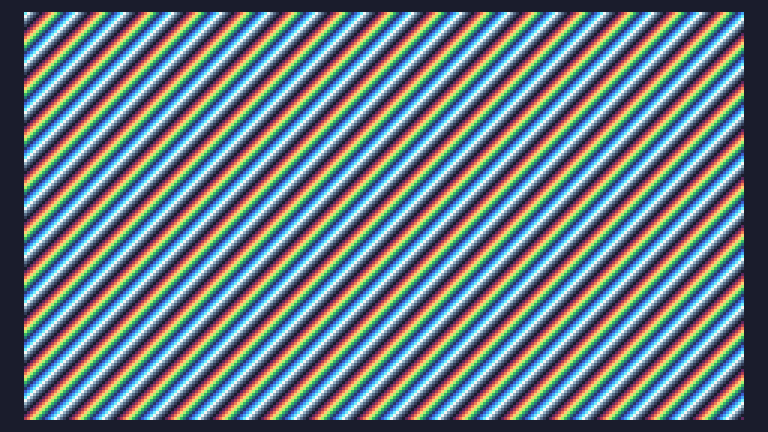

# Tiny Code Christmas 2022

Here are my simple solutions for the [Tiny Code Christmas](https://tcc.lovebyte.party) event. I was mostly interested in learning demo coding basics, so the implementations aren't within the size challenge limits.

The solutions are for the [TIC-80](https://tic80.com) fantasy console and written in Lua (which I've never touched before). TIC-80 is fun and free. You can use it to load the `.tic` cartridges and play around with my "demos".

## Day 1

## Day 2

## Day 3

## Day 4

## Day 5

## Day 6

## Day 7

Skip

## Day 8

## Day 9

## Day 10

## Day 11

## Day 12

TODO
